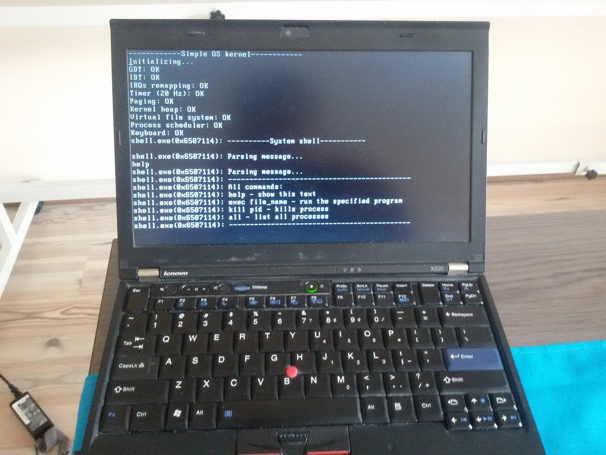

=====
About
=====

.. image:: https://travis-ci.org/povilasb/simple-os.svg?branch=master

SOS (Simple Operating System) is a very basic multiprocess operating system
that runs on x86 machines. It was implemented as a university task.

Currently it only runs in 32bit mode.

Build requirements
==================

::

    $ apt install g++ xxd make nasm

Gallery
=======

.. image:: img/qemu.png

Similar projects
================

* https://github.com/jbush001/os
* https://github.com/dthain/basekernel
* https://github.com/domspad/yehos
* https://github.com/blastrock/flix - C++ based kernel.
* https://github.com/pdziepak/quarnos - C++ kernel with musl libc.
* https://github.com/AtheMathmo/toy-os - Rust based kernel.
* https://github.com/WesleyAC/subatomic - Rust based OS.
